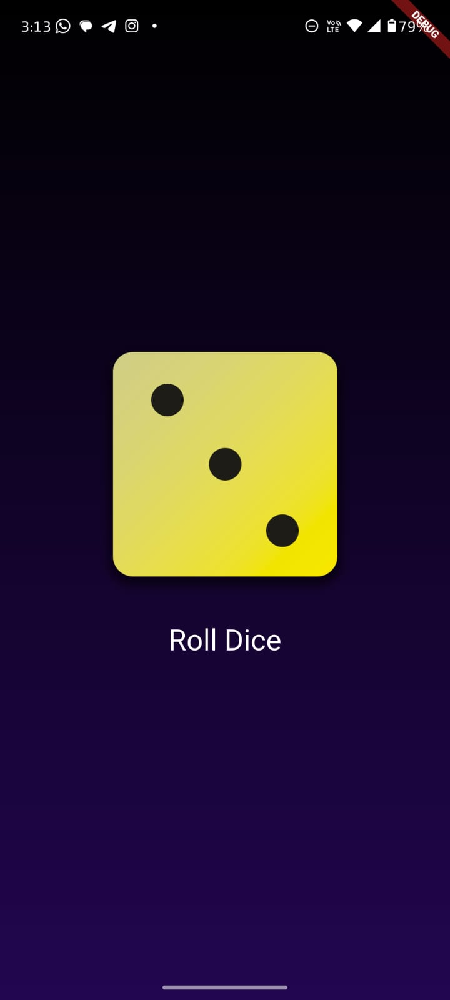

# 🎲 Flutter Dice Roller App

A minimal yet aesthetic dice roller application built using **Flutter** and **Dart**.  
This is my first Flutter app where I explored and implemented fundamental concepts like state management, widgets, and UI rendering.

---

## 📱 Preview



---

## 🚀 Features

- Simple and intuitive UI
- Random dice roll using Dart's core logic
- Interactive dice with smooth updates
- Gradient background for modern look

---

## 🛠️ What I Learned

This project helped me understand:

- Stateless vs Stateful widgets
- Gesture handling (onTap)
- Updating UI using `setState()`
- Asset management and layouting
- Dart basics (variables, functions, random numbers)

---

## 📦 Tech Stack

- **Flutter**
- **Dart**
- Material Design
- VS Code / Android Studio

---

## 📸 Screenshots

You can find the UI preview above. The background has a gradient and the dice is rendered with a shadowed 3D feel.

---

## 🔧 How to Run

1. Clone the repo
   ```bash
   git clone https://github.com/yourusername/flutter-dice-app.git
   cd flutter-dice-app
